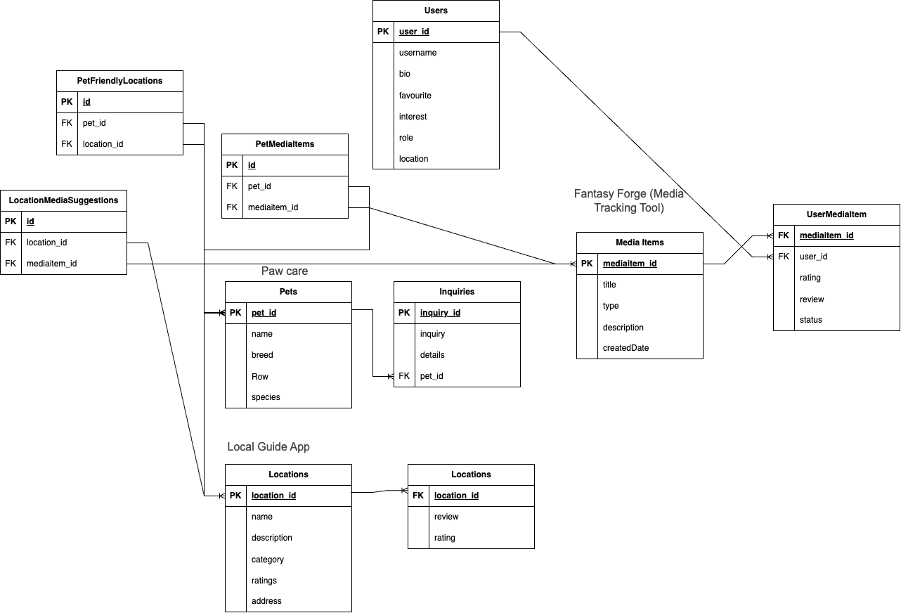

# Wag Wander

Welcome to "Wag Wander," an innovative platform that combines pet adoption, local exploration, and media tracking into a unified user experience. LifeExplorer allows users to adopt pets, discover pet-friendly local spots, and track media related to their interests, all within a single, cohesive application.

## Concept and Vision

The vision behind Wag Wander is to create an interconnected ecosystem that enhances the user's lifestyle by integrating three core areas:

1. Pet Adoption (Pawcare): Users can browse and adopt pets, manage inquiries, and rate their experiences.
2. Local Exploration (Local Guide App): Users can explore local attractions, restaurants, events, and services, with a special focus on pet-friendly locations.
3. Media Tracking (Fantasy Forge): Users can track their favorite TV shows, movies, and games, with recommendations tailored to their interests and local culture.

## User Journey:

1. Profile Setup: A user creates a profile on LifeExplorer and selects interests in pet adoption, local exploration, and media tracking.
2. Adopting a Pet: The user browses pets available for adoption on Pawcare and sends an inquiry about a pet.
3. Exploring Local Spots: The user checks out local pet-friendly parks and cafes from the Local Guide App.
4. Tracking Media: The user tracks media items related to pet care and local culture on Fantasy Forge.
5. Integrated Experience: The user’s profile shows pet-friendly locations, pet-related media suggestions, and local media recommendations, creating a rich, interconnected experience.

## Admin Features

- Add, Update, and Delete: Admins can manage pets, locations, and media items.
- Manage Associations: Admins can link pets to locations and media items, ensuring data integrity and relevance.

## ER Diagram

